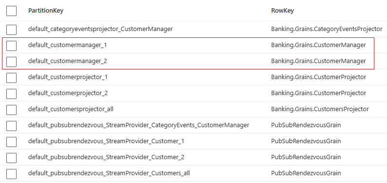
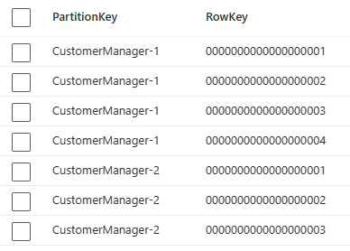
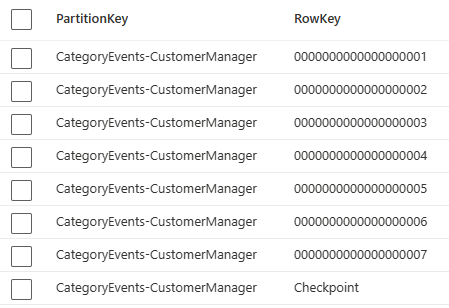
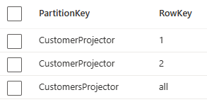

# orleans-event-sourcing

This is an example of a CQRS + event sourcing implementation using Orleans.

I have actors that process commands and produce events and I have separate actors that project those events to projections and deal with the queries retrieving the projections.

The command actors stream the events. The projector actors subscribe to those streams. Multiple projector actors can subscribe to the same stream to project the events in different ways to different projections.

The commands require the single-threaded execution of actors to avoid concurrency violations. The projectors also require the single-threaded execution of actors to project the events in the correct sequence and to avoid concurrency violations. The queries on the other hand can retrieve the current state of the projections in parallel without blocking the projector from projecting new events through the use of the AlwaysInterleaveAttribute (and by being separate actors also without blocking the command actors). 

The Orleans.EventSourcing.**LogStorage**.LogConsistencyProvider stores the individual events (as opposed to the Orleans.EventSourcing.**StateStorage**.LogConsistencyProvider that stores the state but not the individual events). However, Orleans.EventSourcing.**LogStorage**.LogConsistencyProvider persists those individual events in a single row in Azure Table Storage that is constantly updated and could grow very large in size with many events. See the image below where multiple events are stored in each row of the two CustomerManager actor instances.

Event storage should be append-only. So I ended up using Orleans.EventSourcing.**CustomStorage**.LogConsistencyProvider with my own implementation that persists the indivual events to separate rows in Azure Table Storage. I have not implementing snapshots though. See below image showing events from two actor instances with the RowKey being the version / sequence number

The example uses the Azure Queue stream provider for durable queues. Azure Queues are not rewindable though. If I introduce a new version of a projection grain (would streaming subscribers care about grain interface versioning?) I could also migrate the version of the projection state in storage. However, if I lost my projection storage or for other reason want to recreate my projections at some point in the future, I want to rewind the streams to the very first event. I could use Azure Event Hubs that are rewindable up to a certain expiration time of the events. What I would really like is to use the Azure **Table** Storage to allow me to rewind streams to the very first event without any expiration time of the events. 

To make this possible I have a CategoryEventsProjector that stores all events from all actors in a new stream with its own version / sequence numbering of all the events (inspired by the by_category projection in EventStoreDB, see https://developers.eventstore.com/server/v22.10/projections.html#by-category). The events are duplicated but storage is cheap, right? Stream is an overloaded term here as in event sourcing this is a stream of events with a stream id (grain id), whereas in Orleans Streaming this is pubsub with a namespace and key. I could (still to do) build a pulling agent that pulls all events out of the category events stream and publishes them again to Orleans Streaming to allow all projectors to recreate their projections from the very first event. The category events stream is needed because I don't know how many streams of events were created and what their (original) stream id may be. The category events stream contains all events from all grain / actor instances. See below image showing the same events from the two actor instances from the previous image but now with a new version / sequence number

All events from all grain instances of the same grain type are stored with the same partitionKey here, so consider whether all events will fit in the maximum partition storage size. 

To create a cursor over Azure Table Storage I need the RowKey to be sortable. The RowKey is a string and is filled with the integer Version (sequence number) of an event. So to make the string RowKey sortable I need to format the integer Version using version.ToString("D19", CultureInfo.InvariantCulture). Sorting using string comparison is not going to be as fast as using integer comparison though.

The CategoryEvents stream could be the only stream that the command actors publish their events to. All other streams could be published to from the CategoryEventsProjector (or from the pulling agent mentioned above). This would be a potential bottleneck though. So for now the command actors publish their events to all possible streams that the different projectors require. Assuming the publishing to the streams is fast (faster than the command actors calling all projector actors directly), this should not hold up the command actors too much.

And finally, the projections are stored as in the image below

All projection instances of a projection type are stored with the same partitionKey here, so consider whether all instances will fit in the maximum partition storage size.

## TO DO
- Create a fully rewindable streaming provider to the very first event, without expiration time of events, based on the event storage in Azure **Table** Storage. Or alternatively, create a pulling agent that pulls events out of Azure Table Storage and publishes the events to streams. Either case some cursor over Azure Table Storage is required where the RowKey must be sortable to allow paging of the query results.
- Rountrip request context from a command to the events to the streams to the projectors to allow the projectors to notify clients (via SignalR) when a projection is updated as a result of the command. In combination with above mentioned fully rewindable streaming provider this will also require storing the request context in the metadata of the event in event storage.
- For lack of a transaction around grain persistence and streaming and for lack of an Outbox investigate how to deal with streaming failures after successful grain persistence. Possible solution is to retry failed calls to grains, detect idempotency to prevent persisting the same events again, but do stream the events again. This also requires the streaming subscribers to detect duplicate messages (Inbox) to prevent duplicate message processing. This may require giving commands and events unique id's and storing the originating command id in the event metadata. (keeping in mind this discussion of an in-memory outbox https://masstransit.io/documentation/patterns/in-memory-outbox)
